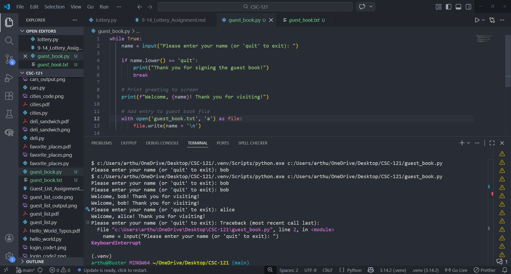
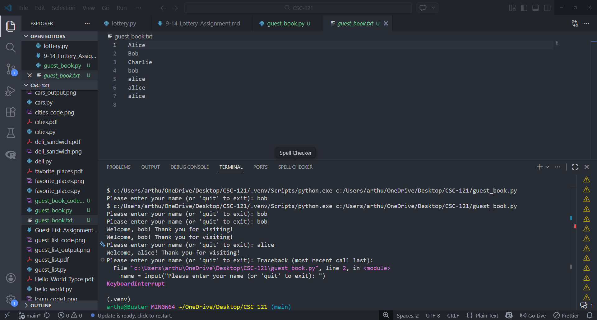

# Guest Book Assignment

## Assignment Instructions
Write a while loop that prompts users for their name. When they enter their name, print a greeting to the screen and add a line recording their visit in a file called guest_book.txt. Make sure each entry appears on a new line in the file.

## Python Program Code

```python
while True:
    name = input("Please enter your name (or 'quit' to exit): ")
    
    if name.lower() == 'quit':
        print("Thank you for signing the guest book!")
        break
    
    # Print greeting to screen
    print(f"Welcome, {name}! Thank you for visiting!")
    
    # Add entry to guest book file
    with open('guest_book.txt', 'a') as file:
        file.write(name + '\n')
```

## Program Output



## Guest Book File Contents



## Summary
This program uses a while loop to continuously collect visitor names. Each name receives a personalized greeting when entered, and is automatically saved to guest_book.txt with each entry on a new line. Users can exit by typing 'quit'.

## Python File
[guest_book.py](guest_book.py)
