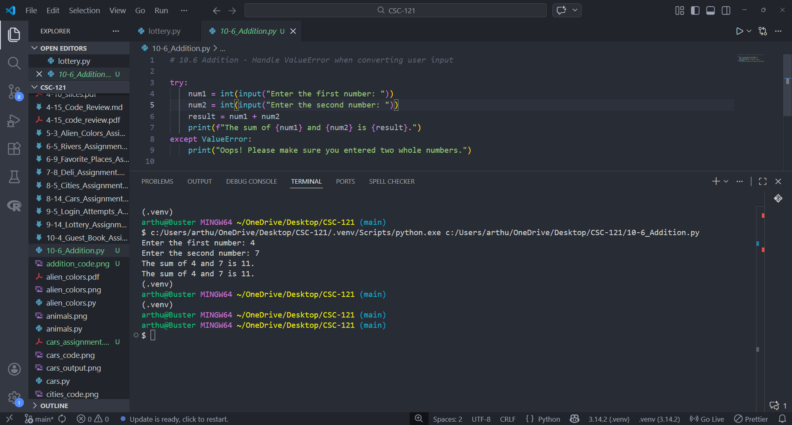
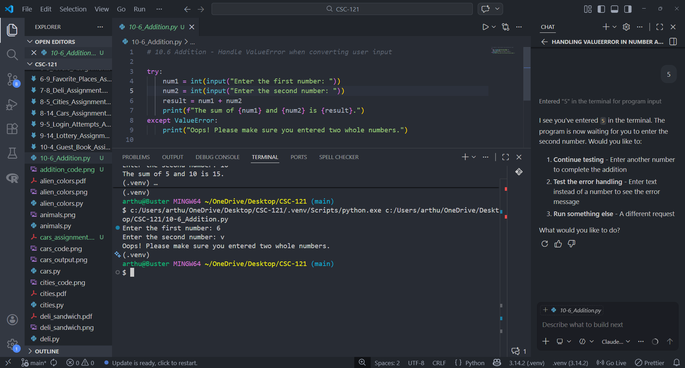

# Addition Assignment

## Assignment Instructions
Write a program that prompts for two numbers. Add them together and print the result. Catch the ValueError if either input value is not a number, and print a friendly error message. Test your program by entering two numbers and then by entering some text instead of a number.

## Python Program Code

```python
# 10.6 Addition - Handle ValueError when converting user input

try:
    num1 = int(input("Enter the first number: "))
    num2 = int(input("Enter the second number: "))
    result = num1 + num2
    print(f"The sum of {num1} and {num2} is {result}.")
except ValueError:
    print("Oops! Please make sure you entered two whole numbers.")
```

## Program Output - Valid Input



## Program Output - Error Handling



## Summary
This program demonstrates proper exception handling when prompting for numerical input. It uses a try-except block to catch ValueError exceptions that occur when users enter non-numeric values instead of numbers. When valid numbers are entered, their sum is calculated and displayed. When invalid input is detected, a user-friendly error message is shown.

## Python File
[10-6_Addition.py](10-6_Addition.py)
