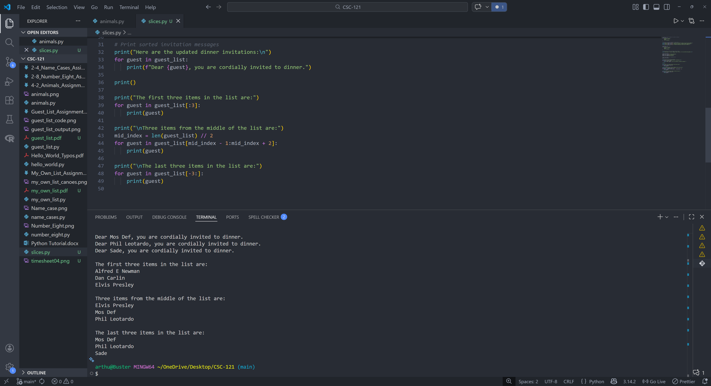

# 4-10. Slices Assignment

## Assignment Instructions
Make a copy of the MoreGuests_Sorted program, name it Slices, and add lines that print the first three items, three middle items, and the last three items in the list using slices.

## Python Program Code

```python
# Create a list of people to invite to dinner
guest_list = [
    "Alfred E Newman",
    "Sade",
    "Phil Leotardo"
]

# Print an invitation message to each guest
print(f"Dear {guest_list[0]}, I would be honored to have you join me for dinner.")
print(f"Dear {guest_list[1]}, please join me for a special dinner gathering.")
print(f"Dear {guest_list[2]}, it would be amazing to have you at dinner.")

# Original guest list
guest_list = [
    "Alfred E Newman",
    "Sade",
    "Phil Leotardo"
]

# Inform guests about the bigger dinner table
print("Good news! I found a bigger dinner table, so I can invite more guests.\n")

# Add new guests
guest_list.insert(0, "Elvis Presley")
guest_list.insert(2, "Mos Def")
guest_list.append("Dan Carlin")

# Sort the guest list alphabetically
guest_list.sort()

# Print sorted invitation messages
print("Here are the updated dinner invitations:\n")
for guest in guest_list:
    print(f"Dear {guest}, you are cordially invited to dinner.")

print()

print("The first three items in the list are:")
for guest in guest_list[:3]:
    print(guest)

print("\nThree items from the middle of the list are:")
mid_index = len(guest_list) // 2
for guest in guest_list[mid_index - 1:mid_index + 2]:
    print(guest)

print("\nThe last three items in the list are:")
for guest in guest_list[-3:]:
    print(guest)
```

## Program Output
```
Dear Alfred E Newman, I would be honored to have you join me for dinner.
Dear Sade, please join me for a special dinner gathering.
Dear Phil Leotardo, it would be amazing to have you at dinner.
Good news! I found a bigger dinner table, so I can invite more guests.

Here are the updated dinner invitations:

Dear Alfred E Newman, you are cordially invited to dinner.
Dear Dan Carlin, you are cordially invited to dinner.
Dear Elvis Presley, you are cordially invited to dinner.
Dear Mos Def, you are cordially invited to dinner.
Dear Phil Leotardo, you are cordially invited to dinner.
Dear Sade, you are cordially invited to dinner.

The first three items in the list are:
Alfred E Newman
Dan Carlin
Elvis Presley

Three items from the middle of the list are:
Elvis Presley
Mos Def
Phil Leotardo

The last three items in the list are:
Mos Def
Phil Leotardo
Sade
```

## Code and Output Screenshot


## Description

This program builds the dinner guest list, sorts it, prints invitations, and then uses list slicing to display the first three, middle three, and last three items.

## GitHub Repository
File uploaded to: https://github.com/arthurcathey/CSC-121/blob/main/slices.py
