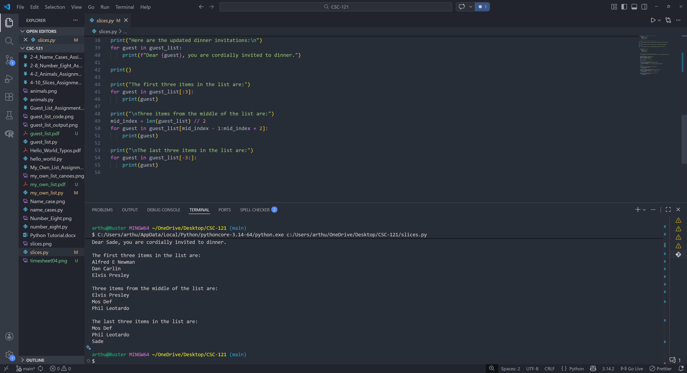
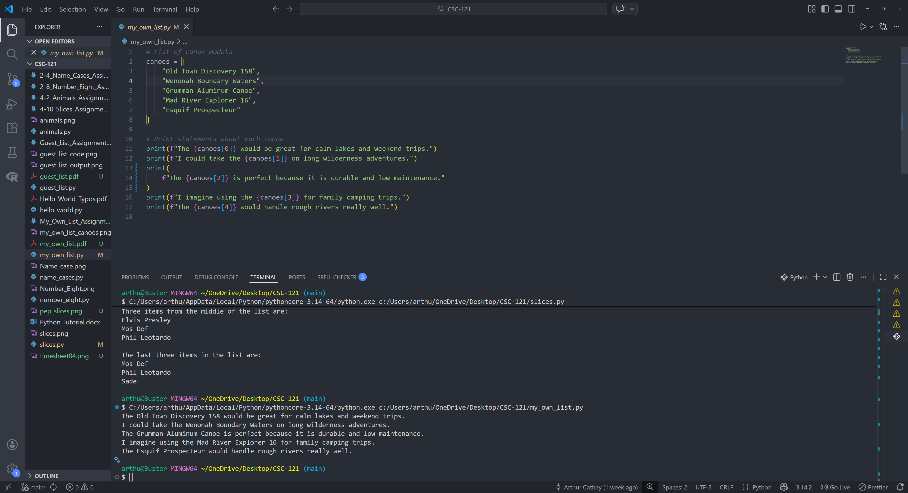
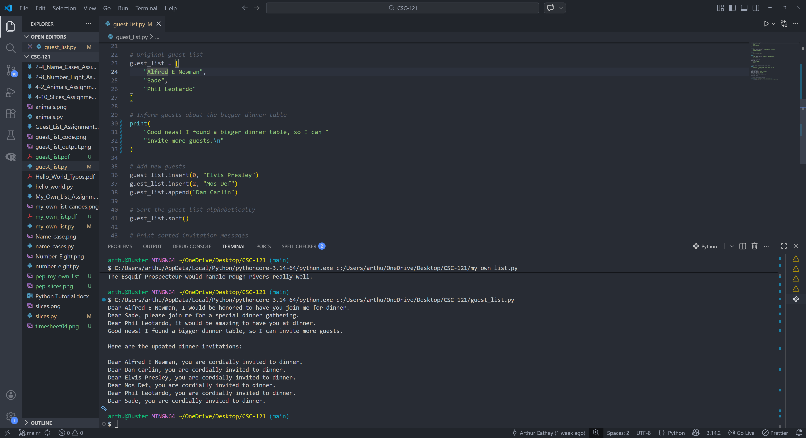

# 4-15. Code Review

## Assignment Instructions
Choose three programs and update them to follow PEP 8: four-space
indentation, lines under 80 characters, and no excessive blank lines.
Capture screenshots of the code and output and label them “4-15. Code
Review.”

## 4-15. Code Review - Slices

Program File: [slices.py](slices.py)

### Python Program Code
```python
# Create a list of people to invite to dinner
guest_list = [
    "Alfred E Newman",
    "Sade",
    "Phil Leotardo"
]

# Print an invitation message to each guest
print(
    f"Dear {guest_list[0]}, I would be honored to have you join me for dinner."
)
print(
    f"Dear {guest_list[1]}, please join me for a special dinner gathering."
)
print(
    f"Dear {guest_list[2]}, it would be amazing to have you at dinner."
)

# Original guest list
guest_list = [
    "Alfred E Newman",
    "Sade",
    "Phil Leotardo"
]

# Inform guests about the bigger dinner table
print("Good news! I found a bigger dinner table, so I can invite more guests.\n")

# Add new guests
guest_list.insert(0, "Elvis Presley")
guest_list.insert(2, "Mos Def")
guest_list.append("Dan Carlin")

# Sort the guest list alphabetically
guest_list.sort()

# Print sorted invitation messages
print("Here are the updated dinner invitations:\n")
for guest in guest_list:
    print(f"Dear {guest}, you are cordially invited to dinner.")

print()

print("The first three items in the list are:")
for guest in guest_list[:3]:
    print(guest)

print("\nThree items from the middle of the list are:")
mid_index = len(guest_list) // 2
for guest in guest_list[mid_index - 1:mid_index + 2]:
    print(guest)

print("\nThe last three items in the list are:")
for guest in guest_list[-3:]:
    print(guest)
```

### Program Output
```
Dear Alfred E Newman, I would be honored to have you join me for dinner.
Dear Sade, please join me for a special dinner gathering.
Dear Phil Leotardo, it would be amazing to have you at dinner.
Good news! I found a bigger dinner table, so I can invite more guests.

Here are the updated dinner invitations:

Dear Alfred E Newman, you are cordially invited to dinner.
Dear Dan Carlin, you are cordially invited to dinner.
Dear Elvis Presley, you are cordially invited to dinner.
Dear Mos Def, you are cordially invited to dinner.
Dear Phil Leotardo, you are cordially invited to dinner.
Dear Sade, you are cordially invited to dinner.

The first three items in the list are:
Alfred E Newman
Dan Carlin
Elvis Presley

Three items from the middle of the list are:
Elvis Presley
Mos Def
Phil Leotardo

The last three items in the list are:
Mos Def
Phil Leotardo
Sade
```

### Screenshot (Code and Output)


### Description
This program prints dinner invitations, then demonstrates list slicing by
showing the first, middle, and last three guests.

### PEP 8 Updates
This file uses four-space indentation in loops, keeps blank lines minimal,
and wraps long strings where needed to keep lines under 80 characters.

## 4-15. Code Review - My Own List

Program File: [my_own_list.py](my_own_list.py)

### Python Program Code
```python
# List of canoe models
canoes = [
    "Old Town Discovery 158",
    "Wenonah Boundary Waters",
    "Grumman Aluminum Canoe",
    "Mad River Explorer 16",
    "Esquif Prospecteur"
]

# Print statements about each canoe
print(f"The {canoes[0]} would be great for calm lakes and weekend trips.")
print(f"I could take the {canoes[1]} on long wilderness adventures.")
print(
    f"The {canoes[2]} is perfect because it is durable and low maintenance."
)
print(f"I imagine using the {canoes[3]} for family camping trips.")
print(f"The {canoes[4]} would handle rough rivers really well.")
```

### Program Output
```
The Old Town Discovery 158 would be great for calm lakes and weekend trips.
I could take the Wenonah Boundary Waters on long wilderness adventures.
The Grumman Aluminum Canoe is perfect because it is durable and low maintenance.
I imagine using the Mad River Explorer 16 for family camping trips.
The Esquif Prospecteur would handle rough rivers really well.
```

### Screenshot (Code and Output)


### Description
This program stores a list of canoe models and prints a sentence about each one
using list indexing.

### PEP 8 Updates
This file uses four-space indentation and wraps the longest print statement to
keep line lengths under 80 characters.

## 4-15. Code Review - Guest List

Program File: [guest_list.py](guest_list.py)

### Python Program Code
```python
# Create a list of people to invite to dinner
guest_list = [
    "Alfred E Newman",
    "Sade",
    "Phil Leotardo"
]

# Print an invitation message to each guest
print(
    f"Dear {guest_list[0]}, I would be honored to have you "
    "join me for dinner."
)
print(
    f"Dear {guest_list[1]}, please join me for a special "
    "dinner gathering."
)
print(
    f"Dear {guest_list[2]}, it would be amazing to have "
    "you at dinner."
)

# Original guest list
guest_list = [
    "Alfred E Newman",
    "Sade",
    "Phil Leotardo"
]

# Inform guests about the bigger dinner table
print(
    "Good news! I found a bigger dinner table, so I can "
    "invite more guests.\n"
)

# Add new guests
guest_list.insert(0, "Elvis Presley")
guest_list.insert(2, "Mos Def")
guest_list.append("Dan Carlin")

# Sort the guest list alphabetically
guest_list.sort()

# Print sorted invitation messages
print("Here are the updated dinner invitations:\n")
for guest in guest_list:
    print(f"Dear {guest}, you are cordially invited to dinner.")
```

### Program Output
```
Dear Alfred E Newman, I would be honored to have you join me for dinner.
Dear Sade, please join me for a special dinner gathering.
Dear Phil Leotardo, it would be amazing to have you at dinner.
Good news! I found a bigger dinner table, so I can invite more guests.

Here are the updated dinner invitations:

Dear Alfred E Newman, you are cordially invited to dinner.
Dear Dan Carlin, you are cordially invited to dinner.
Dear Elvis Presley, you are cordially invited to dinner.
Dear Mos Def, you are cordially invited to dinner.
Dear Phil Leotardo, you are cordially invited to dinner.
Dear Sade, you are cordially invited to dinner.
```

### Screenshot (Code and Output)


### Description
This program builds a dinner guest list, prints initial invitations, then
expands the list and prints updated invitations for everyone.

### PEP 8 Updates
This file wraps long strings across lines, keeps indentation to four spaces,
and avoids extra blank lines so each line stays under 80 characters.
