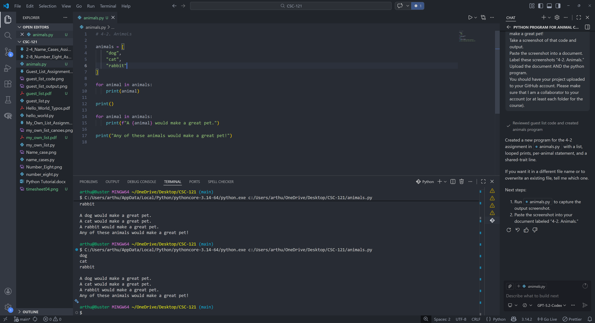

# 4-2. Animals Assignment

## Assignment Instructions
Think of at least three different animals that have a common characteristic. Store the names of these animals in a list, print each animal using a for loop, print a statement about each animal, and end with a line stating what they have in common.

## Python Program Code

```python
# 4-2. Animals

animals = [
    "dog",
    "cat",
    "rabbit"
]

for animal in animals:
    print(animal)

print()

for animal in animals:
    print(f"A {animal} would make a great pet.")

print("Any of these animals would make a great pet!")
```

## Program Output
```
dog
cat
rabbit

A dog would make a great pet.
A cat would make a great pet.
A rabbit would make a great pet.
Any of these animals would make a great pet!
```

## Code and Output Screenshot


## Description

This program stores three pet animals in a list, prints each name, prints a sentence about each animal, and ends with a shared statement about why they are similar.

## GitHub Repository
File uploaded to: https://github.com/arthurcathey/CSC-121/blob/main/animals.py
