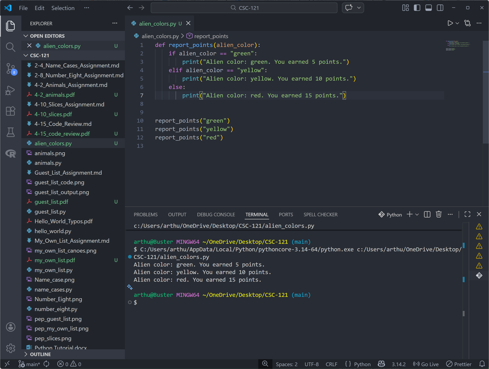

# 5-3. Alien Colors 1-3 Assignment

## Assignment Instructions
Create a program that uses an if-elif-else chain to award points based on alien color. If the alien is green, award 5 points; if yellow, award 10 points; if red, award 15 points. Run the program for each color.

## Python Program Code

```python
# 5-3. Alien Colors 1-3

def report_points(alien_color):
    if alien_color == "green":
        print("Alien color: green. You earned 5 points.")
    elif alien_color == "yellow":
        print("Alien color: yellow. You earned 10 points.")
    else:
        print("Alien color: red. You earned 15 points.")


report_points("green")
report_points("yellow")
report_points("red")
```

## Program Output
```
Alien color: green. You earned 5 points.
Alien color: yellow. You earned 10 points.
Alien color: red. You earned 15 points.
```

## Code and Output Screenshot


## Description

This program uses an if-elif-else chain to award different points based on the alien color and runs the logic three times to show each result.

## GitHub Repository
File uploaded to: https://github.com/arthurcathey/CSC-121/blob/main/alien_colors.py
