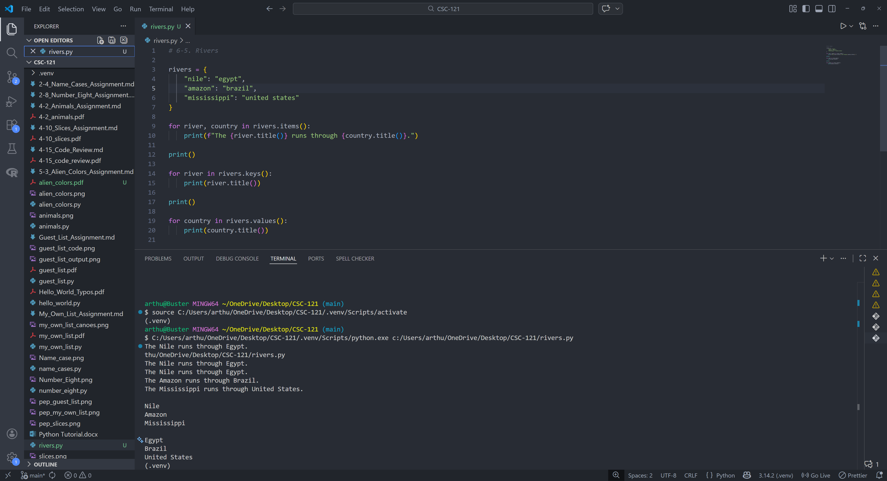

# 6-5. Rivers Assignment

## Assignment Instructions
Write a program that uses a dictionary containing three major rivers and the country each river runs through. Use one loop to print a sentence about each river and country, one loop to print each river name, and one loop to print each country name.

## Python Program Code

```python
# 6-5. Rivers

rivers = {
    "nile": "egypt",
    "amazon": "brazil",
    "mississippi": "united states"
}

for river, country in rivers.items():
    print(f"The {river.title()} runs through {country.title()}.")

print()

for river in rivers.keys():
    print(river.title())

print()

for country in rivers.values():
    print(country.title())
```

## Program Output
```
The Nile runs through Egypt.
The Amazon runs through Brazil.
The Mississippi runs through United States.

Nile
Amazon
Mississippi

Egypt
Brazil
United States
```

## Code and Output Screenshot


## Description

This program uses a dictionary to connect rivers to countries. It loops through key-value pairs to print full sentences, then loops through keys to print river names, and loops through values to print country names.

## GitHub Repository
File uploaded to: https://github.com/arthurcathey/CSC-121/blob/main/rivers.py
