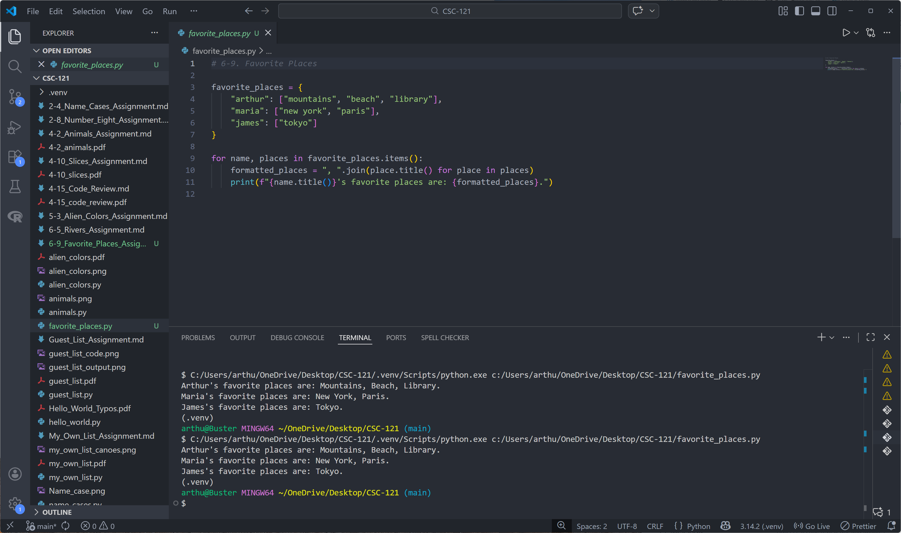

# 6-9. Favorite Places Assignment

## Assignment Instructions
Write a program that uses a dictionary called favorite places. Use three names as keys, and store one to three favorite places for each person. Loop through the dictionary and print each person’s name and their favorite places.

## Python Program Code

```python
# 6-9. Favorite Places

favorite_places = {
    "arthur": ["mountains", "beach", "library"],
    "maria": ["new york", "paris"],
    "james": ["tokyo"]
}

for name, places in favorite_places.items():
    formatted_places = ", ".join(place.title() for place in places)
    print(f"{name.title()}'s favorite places are: {formatted_places}.")
```

## Program Output
```
Arthur's favorite places are: Mountains, Beach, Library.
Maria's favorite places are: New York, Paris.
James's favorite places are: Tokyo.
```

## Code and Output Screenshot


## Description

This program uses a dictionary where each key is a person's name and each value is a list of favorite places. A loop goes through each person and prints their name with all listed places.

## GitHub Repository
File uploaded to: https://github.com/arthurcathey/CSC-121/blob/main/favorite_places.py
