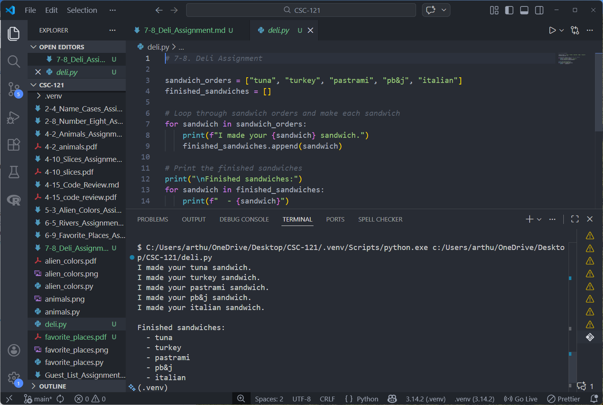

# 7-8. Deli Assignment

## Assignment Instructions
Write a program that uses a list called sandwich_orders and fill it with the names of various sandwiches. Then make an empty list called finished_sandwiches. Loop through the list of sandwich orders and print a message for each order, such as "I made your tuna sandwich." As each sandwich is made, move it to the list of finished sandwiches. After all the sandwiches have been made, print a message listing each sandwich that was made.

## Python Program Code

```python
# 7-8. Deli Assignment

sandwich_orders = ["tuna", "turkey", "pastrami", "pb&j", "italian"]
finished_sandwiches = []

# Loop through sandwich orders and make each sandwich
for sandwich in sandwich_orders:
    print(f"I made your {sandwich} sandwich.")
    finished_sandwiches.append(sandwich)

# Print the finished sandwiches
print("\nFinished sandwiches:")
for sandwich in finished_sandwiches:
    print(f"  - {sandwich}")
```

## Program Output
```
I made your tuna sandwich.
I made your turkey sandwich.
I made your pastrami sandwich.
I made your pb&j sandwich.
I made your italian sandwich.

Finished sandwiches:
  - tuna
  - turkey
  - pastrami
  - pb&j
  - italian
```

## Code and Output Screenshot



## Description

This program manages sandwich orders at a deli. It starts with a list of sandwich orders, creates an empty list for finished sandwiches, and then loops through each order. As each sandwich is made, it prints a message confirming the order and moves it from the orders list to the finished list. Finally, it displays all the completed sandwiches.

## GitHub Repository
File uploaded to: https://github.com/arthurcathey/CSC-121/blob/main/deli.py
