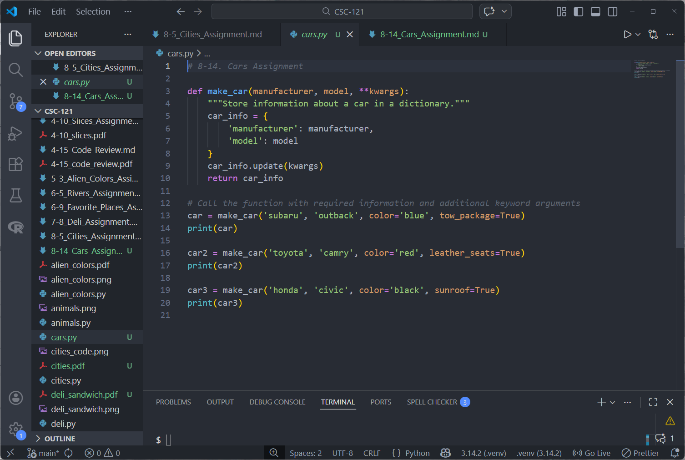
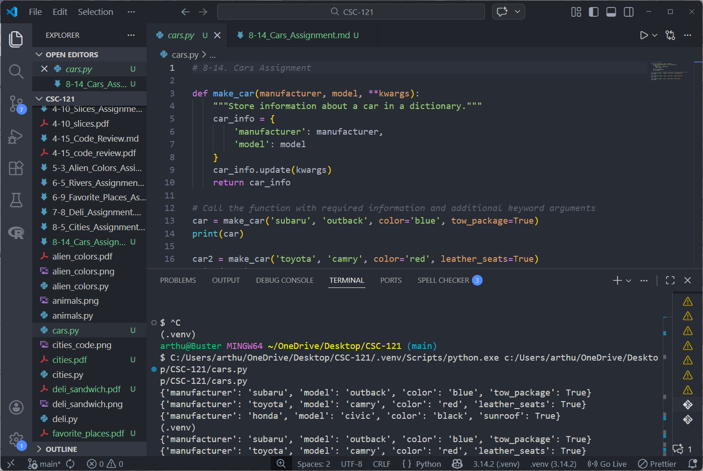

# 8-14. Cars Assignment

## Assignment Instructions
Write a function that stores information about a car in a dictionary. The function should always receive a manufacturer and a model name. It should then accept an arbitrary number of keyword arguments. Call the function with the required information and two other name-value pairs, such as a color or an optional feature. Your function should work for a call like this one: car = make_car('subaru', 'outback', color='blue', tow_package=True). Print the dictionary that's returned to make sure all the information was stored correctly.

## Python Program Code

```python
# 8-14. Cars Assignment

def make_car(manufacturer, model, **kwargs):
    """Store information about a car in a dictionary."""
    car_info = {
        'manufacturer': manufacturer,
        'model': model
    }
    car_info.update(kwargs)
    return car_info

# Call the function with required information and additional keyword arguments
car = make_car('subaru', 'outback', color='blue', tow_package=True)
print(car)

car2 = make_car('toyota', 'camry', color='red', leather_seats=True)
print(car2)

car3 = make_car('honda', 'civic', color='black', sunroof=True)
print(car3)
```

## Program Output
```
{'manufacturer': 'subaru', 'model': 'outback', 'color': 'blue', 'tow_package': True}
{'manufacturer': 'toyota', 'model': 'camry', 'color': 'red', 'leather_seats': True}
{'manufacturer': 'honda', 'model': 'civic', 'color': 'black', 'sunroof': True}
```

## Code and Output Screenshot



## Description

This program defines a function called `make_car()` that accepts a manufacturer and model name as required parameters, along with an arbitrary number of keyword arguments using `**kwargs`. The function creates a dictionary with the manufacturer and model, then updates it with any additional keyword arguments passed in. The function is called three times with different cars and optional features like color and special features. The dictionaries are printed to verify all information was stored correctly.

## GitHub Repository
File uploaded to: https://github.com/arthurcathey/CSC-121/blob/main/cars.py
