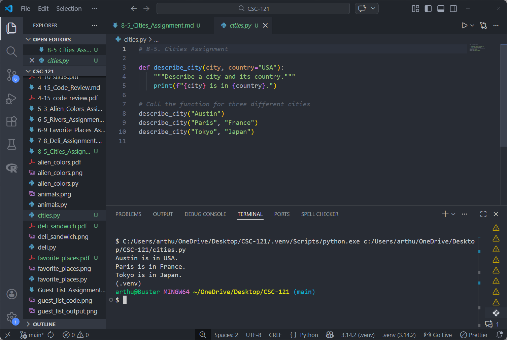

# 8-5. Cities Assignment

## Assignment Instructions
Write a function called describe_city() that accepts the name of a city and its country. The function should print a simple sentence, such as "Reykjavik is in Iceland." Give the parameter for the country a default value. Call your function for three different cities, at least one of which is not in the default country.

## Python Program Code

```python
# 8-5. Cities Assignment

def describe_city(city, country="USA"):
    """Describe a city and its country."""
    print(f"{city} is in {country}.")

# Call the function for three different cities
describe_city("Austin")
describe_city("Paris", "France")
describe_city("Tokyo", "Japan")
```

## Program Output
```
Austin is in USA.
Paris is in France.
Tokyo is in Japan.
```

## Code and Output Screenshot



## Description

This program defines a function called `describe_city()` that takes two parameters: a city name and a country. The country parameter has a default value of "USA". The function prints a descriptive sentence about the city and its country. The function is then called three times with different cities: Austin (using the default country), Paris (with France), and Tokyo (with Japan).

## GitHub Repository
File uploaded to: https://github.com/arthurcathey/CSC-121/blob/main/cities.py
