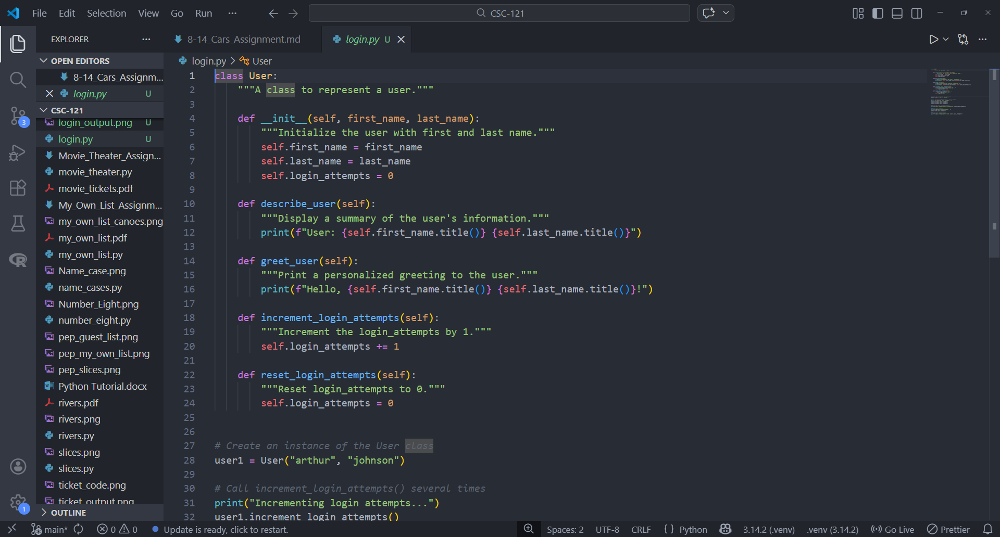
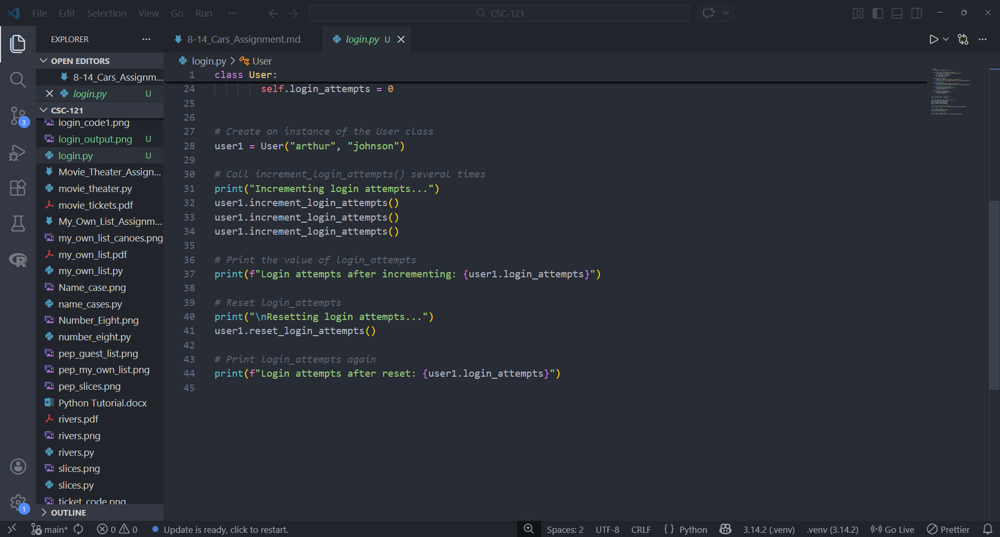
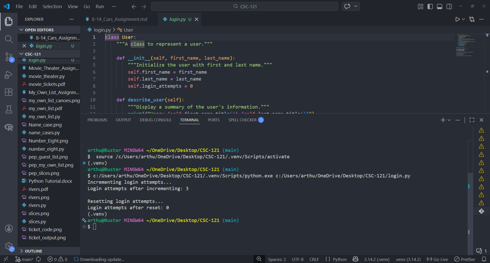

# 9-5. Login Attempts Assignment

## Assignment Instructions
Create a copy of your program from 9-3 "Users" and rename it "Login". Add an attribute called `login_attempts` to your User class from Exercise 9-3. Write a method called `increment_login_attempts()` that increments the value of `login_attempts` by 1. Write another method called `reset_login_attempts()` that resets the value of `login_attempts` to 0. Make an instance of the User class and call `increment_login_attempts()` several times. Print the value of `login_attempts` to make sure it was incremented properly, and then call `reset_login_attempts()`. Print `login_attempts` again to make sure it was reset to 0.

## Python Program Code

```python
class User:
    """A class to represent a user."""
    
    def __init__(self, first_name, last_name):
        """Initialize the user with first and last name."""
        self.first_name = first_name
        self.last_name = last_name
        self.login_attempts = 0
    
    def describe_user(self):
        """Display a summary of the user's information."""
        print(f"User: {self.first_name.title()} {self.last_name.title()}")
    
    def greet_user(self):
        """Print a personalized greeting to the user."""
        print(f"Hello, {self.first_name.title()} {self.last_name.title()}!")
    
    def increment_login_attempts(self):
        """Increment the login_attempts by 1."""
        self.login_attempts += 1
    
    def reset_login_attempts(self):
        """Reset login_attempts to 0."""
        self.login_attempts = 0


# Create an instance of the User class
user1 = User("arthur", "johnson")

# Call increment_login_attempts() several times
print("Incrementing login attempts...")
user1.increment_login_attempts()
user1.increment_login_attempts()
user1.increment_login_attempts()

# Print the value of login_attempts
print(f"Login attempts after incrementing: {user1.login_attempts}")

# Reset login_attempts
print("\nResetting login attempts...")
user1.reset_login_attempts()

# Print login_attempts again
print(f"Login attempts after reset: {user1.login_attempts}")
```

## Program Output
```
Incrementing login attempts...
Login attempts after incrementing: 3

Resetting login attempts...
Login attempts after reset: 0
```

## Code and Output Screenshot




## Description

This program defines a `User` class with an attribute `login_attempts` initialized to 0. The class includes two new methods: `increment_login_attempts()` which increases `login_attempts` by 1, and `reset_login_attempts()` which resets the counter back to 0. An instance of the User class is created and `increment_login_attempts()` is called three times, incrementing the counter from 0 to 3. The value is printed to verify the increments, then `reset_login_attempts()` is called to reset the counter back to 0, which is also printed to confirm the reset was successful.

## GitHub Repository
File uploaded to: https://github.com/arthurcathey/CSC-121/blob/main/login.py
