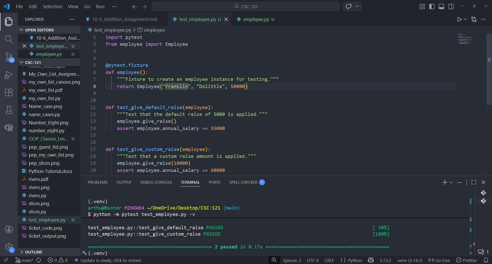

# Employee Class Assignment

## Assignment Instructions
Write a class called Employee. The `__init__()` method should take in a first name, a last name, and an annual salary, and store each of these as attributes. Write a method called `give_raise()` that adds 5,000 to the annual salary by default but also accepts a different raise amount. Write a test file for Employee with two test functions, `test_give_default_raise()` and `test_give_custom_raise()`. Write your tests once without using a fixture, and make sure they both pass. Then write a fixture so you don't have to create a new employee instance in each test function. Run the tests again, and make sure both tests still pass.

## Python Program Code - Employee Class

```python
class Employee:
    """A class to represent an employee."""
    
    def __init__(self, first_name, last_name, annual_salary):
        """Initialize the employee with name and salary."""
        self.first_name = first_name
        self.last_name = last_name
        self.annual_salary = annual_salary
    
    def give_raise(self, raise_amount=5000):
        """Add a raise to the annual salary.
        
        Args:
            raise_amount: The amount to raise the salary by. Default is 5000.
        """
        self.annual_salary += raise_amount
```

## Python Test Code - test_employee.py

```python
import pytest
from employee import Employee


@pytest.fixture
def employee():
    """Fixture to create an employee instance for testing."""
    return Employee("Franklin", "Dolittle", 50000)


def test_give_default_raise(employee):
    """Test that the default raise of 5000 is applied."""
    employee.give_raise()
    assert employee.annual_salary == 55000


def test_give_custom_raise(employee):
    """Test that a custom raise amount is applied."""
    employee.give_raise(10000)
    assert employee.annual_salary == 60000
```

## Program Output - Test Results



## Summary
This assignment demonstrates creating a class with proper initialization and methods. The Employee class stores employee information (first name, last name, and annual salary) and provides a method to apply raises. The `give_raise()` method uses a default parameter to apply a standard $5,000 raise, but can also accept custom raise amounts. The test file uses pytest with a fixture pattern to efficiently test both the default and custom raise functionality. Both tests pass successfully, validating that the Employee class works correctly.

## Python Files
- [employee.py](employee.py)
- [test_employee.py](test_employee.py)
