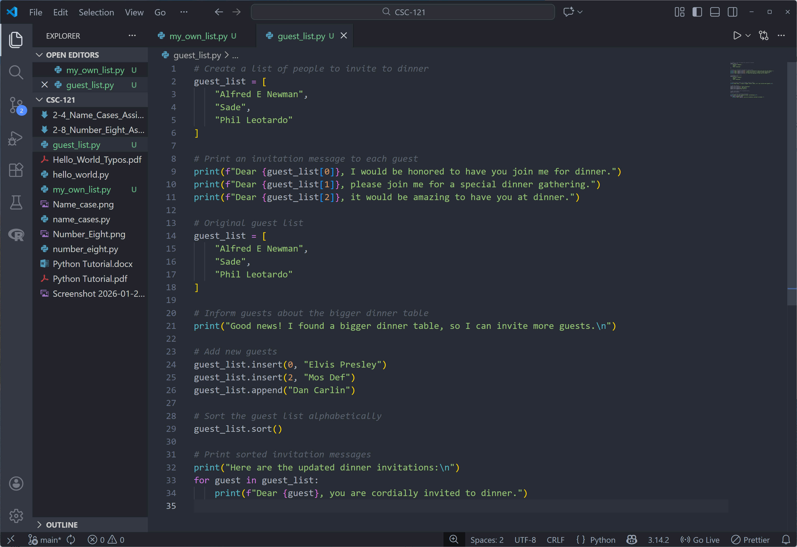
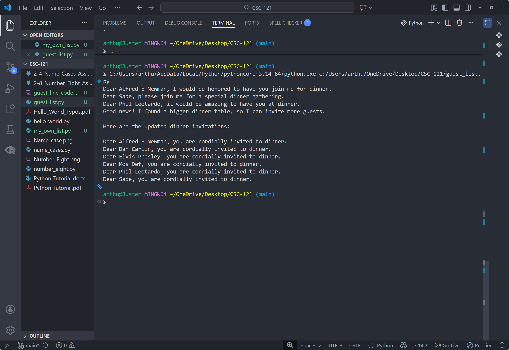

# Guest List Assignment

## Assignment Instructions
Create a list of people to invite to dinner, print invitation messages, expand the list, sort it alphabetically, and print updated invitations.

## Python Program Code

```python
# Create a list of people to invite to dinner
guest_list = [
    "Alfred E Newman",
    "Sade",
    "Phil Leotardo"
]

# Print an invitation message to each guest
print(f"Dear {guest_list[0]}, I would be honored to have you join me for dinner.")
print(f"Dear {guest_list[1]}, please join me for a special dinner gathering.")
print(f"Dear {guest_list[2]}, it would be amazing to have you at dinner.")

# Original guest list
guest_list = [
    "Alfred E Newman",
    "Sade",
    "Phil Leotardo"
]

# Inform guests about the bigger dinner table
print("Good news! I found a bigger dinner table, so I can invite more guests.\n")

# Add new guests
guest_list.insert(0, "Elvis Presley")
guest_list.insert(2, "Mos Def")
guest_list.append("Dan Carlin")

# Sort the guest list alphabetically
guest_list.sort()

# Print sorted invitation messages
print("Here are the updated dinner invitations:\n")
for guest in guest_list:
    print(f"Dear {guest}, you are cordially invited to dinner.")
```

## Program Output
```
Dear Alfred E Newman, I would be honored to have you join me for dinner.
Dear Sade, please join me for a special dinner gathering.
Dear Phil Leotardo, it would be amazing to have you at dinner.
Good news! I found a bigger dinner table, so I can invite more guests.

Here are the updated dinner invitations:

Dear Alfred E Newman, you are cordially invited to dinner.
Dear Dan Carlin, you are cordially invited to dinner.
Dear Elvis Presley, you are cordially invited to dinner.
Dear Mos Def, you are cordially invited to dinner.
Dear Phil Leotardo, you are cordially invited to dinner.
Dear Sade, you are cordially invited to dinner.
```

## Code Screenshot


## Output Screenshot


## Description

This program builds a dinner guest list, prints initial invitations, then expands the list after finding a bigger table. It inserts and appends new guests, sorts the list alphabetically, and prints updated invitations for everyone.

## GitHub Repository
File uploaded to: https://github.com/arthurcathey/CSC-121/blob/main/guest_list.py
