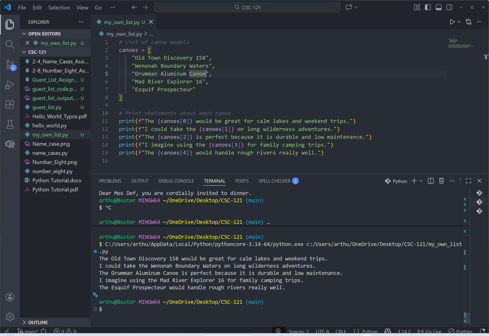

# My Own List Assignment

## Assignment Instructions
Create a list of items you like and print a statement about each item using list indexing.

## Python Program Code

```python
# List of canoe models
canoes = [
    "Old Town Discovery 158",
    "Wenonah Boundary Waters",
    "Grumman Aluminum Canoe",
    "Mad River Explorer 16",
    "Esquif Prospecteur"
]

# Print statements about each canoe
print(f"The {canoes[0]} would be great for calm lakes and weekend trips.")
print(f"I could take the {canoes[1]} on long wilderness adventures.")
print(f"The {canoes[2]} is perfect because it is durable and low maintenance.")
print(f"I imagine using the {canoes[3]} for family camping trips.")
print(f"The {canoes[4]} would handle rough rivers really well.")
```

## Program Output
```
The Old Town Discovery 158 would be great for calm lakes and weekend trips.
I could take the Wenonah Boundary Waters on long wilderness adventures.
The Grumman Aluminum Canoe is perfect because it is durable and low maintenance.
I imagine using the Mad River Explorer 16 for family camping trips.
The Esquif Prospecteur would handle rough rivers really well.
```

## Code Screenshot


## Description

This program stores a list of canoe models and prints a sentence about each one by accessing the list items by index.

## GitHub Repository
File uploaded to: https://github.com/arthurcathey/CSC-121/blob/main/my_own_list.py
